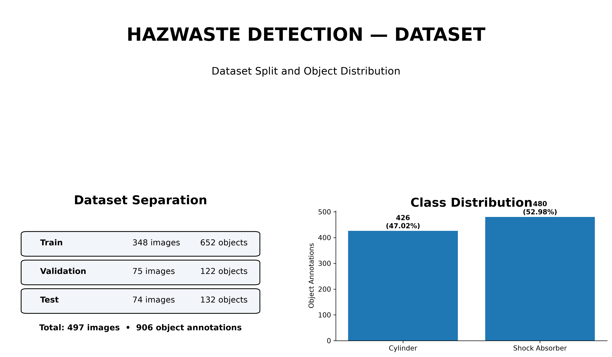
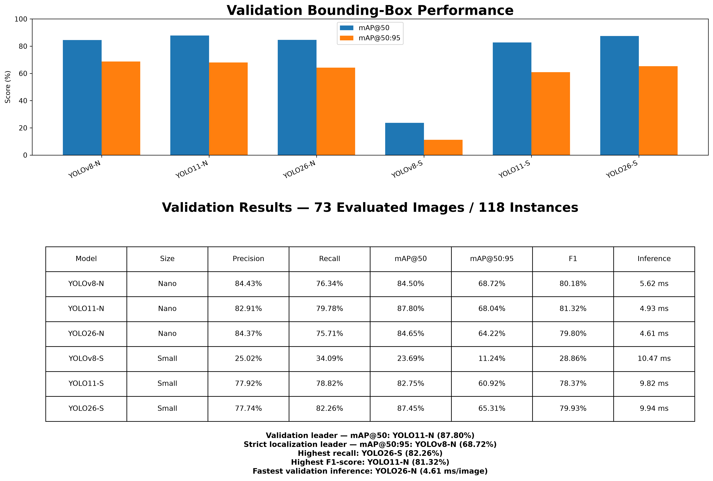
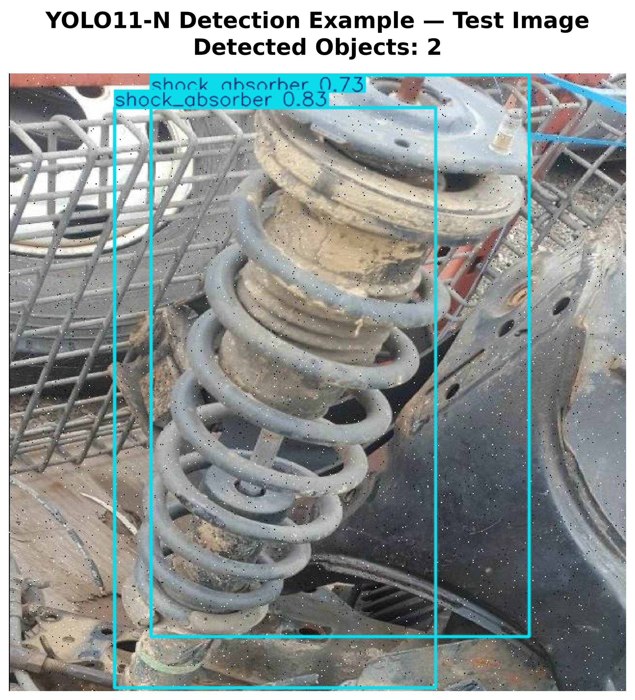

# ⚠️ HazWaste Detection System

**YOLO-based detection of hazardous waste components — Cylinders and Shock Absorbers — for safer waste-processing environments.**

Built with **Python | Ultralytics YOLO | PyTorch | OpenCV | FastAPI | HTML/CSS/JavaScript | GitHub | Render**

---

## 📋 Table of Contents

1. [Project Overview](#1-project-overview)
2. [Problem Statement](#2-problem-statement)
3. [Project Objectives](#3-project-objectives)
4. [Dataset](#4-dataset)
5. [Data Augmentation](#5-data-augmentation)
6. [Methodology](#6-methodology)
7. [YOLO Model Comparison](#7-yolo-model-comparison)
8. [Evaluation Metrics](#8-evaluation-metrics)
9. [Final Model Selection](#9-final-model-selection)
10. [Web Application](#10-web-application)
11. [Project Structure](#11-project-structure)
12. [Setup and Installation](#12-setup-and-installation)
13. [Running the Application](#13-running-the-application)
14. [Deployment](#14-deployment)
15. [Limitations](#15-limitations)
16. [Future Improvements](#16-future-improvements)

---

## 1. Project Overview

HazWaste Detection is a computer-vision system designed to identify hazardous components that may enter waste-processing or crushing machinery.

The system detects and classifies two target classes:

- **Cylinder**
- **Shock Absorber**

The project covers the complete machine-learning workflow:

```text
Dataset Collection
        ↓
Data Preparation & Quality Check
        ↓
Data Augmentation
        ↓
YOLO Model Training
        ↓
Validation
        ↓
Final Test
        ↓
Model Comparison
        ↓
Web-Based Deployment
```

---

## 2. Problem Statement

Waste-processing and scrap-handling machinery is designed to process a wide variety of materials. However, certain hazardous components may create serious equipment and safety risks if they enter the processing stage.

Examples include:

- **Gas cylinders:** may contain pressurized gases and can create a severe hazard if subjected to crushing or mechanical processing.
- **Shock absorbers:** are mechanical components that may damage processing equipment and create unsafe conditions if not identified before processing.

Manual identification of these objects can be slow and inconsistent.

This project therefore develops an automated object-detection system that can:

- Detect hazardous objects.
- Localize them using bounding boxes.
- Classify them as cylinder or shock absorber.
- Support image, video, and webcam inputs.
- Provide a basis for safer automated waste handling.

> **Important:** This project is a prototype/research system and is not a certified industrial safety system.

---

## 3. Project Objectives

The main objectives are:

1. Build a two-class hazardous-object detection dataset.
2. Prepare and validate image/annotation pairs.
3. Apply data augmentation to improve model robustness.
4. Train multiple YOLO model variants.
5. Compare Nano and Small model families.
6. Evaluate models using precision, recall, mAP and F1-score.
7. Compare inference speed and model complexity.
8. Select a suitable model based on measured performance.
9. Integrate the trained model into a browser-based application.
10. Prepare the application for online deployment.

---

## 4. Dataset

### Target Classes

| Class ID | Class Name |
|---:|---|
| 0 | Cylinder |
| 1 | Shock Absorber |

### Dataset Split

| Split | Images | Annotation Files | Object Annotations | Cylinder | Shock Absorber |
|---|---:|---:|---:|---:|---:|
| Train | 348 | 348 | 652 | 308 | 344 |
| Validation | 75 | 75 | 122 | 56 | 66 |
| Test | 74 | 74 | 132 | 62 | 70 |
| **Total** | **497** | **497** | **906** | **426** | **480** |

### Overall Class Distribution

- **Cylinder:** 426 objects — 47.02%
- **Shock Absorber:** 480 objects — 52.98%

The two classes are reasonably balanced at the object level.

### Dataset Visualization



---

## 5. Data Augmentation

Data augmentation was performed using **Roboflow** to increase variation in the training data and improve model robustness.

The applied augmentation techniques included:

- **Rotation:** up to ±90°
- **Noise:** up to 20%
- **Cropping**
- **Flipping**

These transformations were intended to expose the detector to different object orientations, image conditions and spatial variations.

---

## 6. Methodology

### Step 1 — Dataset Collection & Preparation

Images containing cylinders and shock absorbers were collected and organized into training, validation and test subsets.

### Step 2 — Data Preprocessing & Quality Check

The dataset was checked for:

- Missing image/label pairs
- Invalid annotation lines
- Invalid class IDs
- Empty label files
- Inconsistent annotation formats

### Step 3 — Model Training

Three YOLO generations were evaluated:

- YOLOv8
- YOLO11
- YOLO26

Two model sizes were tested for each generation:

- **Nano (N)**
- **Small (S)**

### Step 4 — Model Validation

The trained checkpoints were evaluated on the validation set using:

- Precision
- Recall
- mAP@50
- mAP@50:95
- F1-score
- Inference time

### Step 5 — Final Testing

The best checkpoints were evaluated on the unseen test set.

The final test set contains:

- **74 images**
- **132 object instances**

### Step 6 — Model Comparison

All six trained models were compared using the same target classes and evaluation metrics.

### Step 7 — Web Deployment

The selected model is integrated into a browser-based application supporting image, video and webcam inference.

---

## 7. YOLO Model Comparison

### Models Evaluated

| Family | Nano | Small |
|---|---|---|
| YOLOv8 | YOLOv8-N | YOLOv8-S |
| YOLO11 | YOLO11-N | YOLO11-S |
| YOLO26 | YOLO26-N | YOLO26-S |

### Validation Results

The validation run used 75 available validation images. Two validation samples contained mixed segmentation/detection label formats and were ignored by the evaluator, so the reported validation metrics were calculated on **73 images and 118 instances**.

| Model | Size | Precision | Recall | mAP@50 | mAP@50:95 | F1 | Inference |
|---|---|---:|---:|---:|---:|---:|---:|
| YOLOv8-N | Nano | 84.43% | 76.34% | 84.50% | **68.72%** | 80.18% | 5.62 ms |
| YOLO11-N | Nano | 82.91% | 79.78% | **87.80%** | 68.04% | **81.32%** | 4.93 ms |
| YOLO26-N | Nano | 84.37% | 75.71% | 84.65% | 64.22% | 79.80% | **4.61 ms** |
| YOLOv8-S | Small | 25.02% | 34.09% | 23.69% | 11.24% | 28.86% | 10.47 ms |
| YOLO11-S | Small | 77.92% | 78.82% | 82.75% | 60.92% | 78.37% | 9.82 ms |
| YOLO26-S | Small | 77.74% | **82.26%** | 87.45% | 65.31% | 79.93% | 9.94 ms |

### Validation Visualization



### Validation Observations

- **YOLO11-N** achieved the highest validation **mAP@50 (87.80%)** and **F1-score (81.32%)**.
- **YOLOv8-N** achieved the highest validation **mAP@50:95 (68.72%)**, indicating the strongest performance among these models under the stricter localization metric.
- **YOLO26-S** achieved the highest validation **recall (82.26%)**.
- **YOLO26-N** achieved the fastest validation inference time at **4.61 ms/image**.

---

## 8. Evaluation Metrics

### Precision

Precision measures how many predicted detections are correct.

```text
Precision = TP / (TP + FP)
```

### Recall

Recall measures how many of the actual target objects are detected.

```text
Recall = TP / (TP + FN)
```

### F1-score

F1-score provides a balance between precision and recall.

```text
F1 = 2 × (Precision × Recall) / (Precision + Recall)
```

### IoU

Intersection over Union measures the overlap between the predicted bounding box and the ground-truth bounding box.

```text
IoU = Intersection / Union
```

### mAP@50

Mean Average Precision at an IoU threshold of 0.50.

### mAP@50:95

Mean Average Precision averaged over IoU thresholds from 0.50 to 0.95 in 0.05 increments.

This stricter metric provides additional information about bounding-box localization quality.

---

## 9. Final Model Selection

### Final Test Results

The six trained models were evaluated on the same unseen test set containing **74 images and 132 object instances**.

| Rank | Model | Precision | Recall | mAP@50 | mAP@50:95 | F1 | Inference |
|---:|---|---:|---:|---:|---:|---:|---:|
| 1 | **YOLO11-N** | 72.72% | **75.83%** | **78.59%** | **58.52%** | 74.24% | 5.95 ms |
| 2 | YOLO26-N | **75.17%** | 73.84% | 76.08% | 55.67% | **74.50%** | **4.57 ms** |
| 3 | YOLO26-S | 70.43% | 75.48% | 75.42% | 51.17% | 72.87% | 10.34 ms |
| 4 | YOLOv8-N | 77.65% | 68.44% | 76.20% | 57.74% | 72.75% | 4.34 ms |
| 5 | YOLO11-S | 73.17% | 69.88% | 75.89% | 53.88% | 71.49% | 10.37 ms |
| 6 | YOLOv8-S | 25.92% | 31.77% | 22.43% | 11.37% | 28.55% | 9.89 ms |

### Selected Model: YOLO11-N

Based on the current test results, **YOLO11-N is selected as the overall lightweight model candidate**.

Reasons:

- Highest test **mAP@50: 78.59%**
- Highest test **mAP@50:95: 58.52%**
- Strong test **recall: 75.83%**
- F1-score: **74.24%**
- Low inference latency: **5.95 ms/image**
- Lightweight architecture with approximately **2.58 million parameters**

YOLO26-N is the fastest of the six models in this evaluation, while YOLOv8-N has the highest test precision. Therefore, the final selection depends on the deployment objective; for the current project, **YOLO11-N provides the best overall balance of detection quality and efficiency**.

> Model selection is based on the measured results on this dataset and should not be interpreted as a universal ranking of YOLO architectures.

---

## 10. Web Application

The project includes a browser-based inference application.

### Supported Inputs

- Image
- Video
- Webcam

### Application Features

- Model selection
- Confidence threshold control
- IoU threshold control
- Bounding-box visualization
- Class labels
- Confidence scores
- Object counts
- Average confidence
- Inference time
- Detection-result download

### Example



---

## 11. Project Structure

```text
hazwaste_detection/
│
├── dataset_stuff/
│   └── balanced_dataset/
│       ├── train/
│       │   ├── images/
│       │   └── labels/
│       ├── valid/
│       │   ├── images/
│       │   └── labels/
│       └── test/
│           ├── images/
│           └── labels/
│
├── model_comparison/
├── model_comparison_nano/
├── all_model_evaluation/
│
├── web_app/
│   ├── models/
│   │   ├── yolov8n/
│   │   ├── yolov8s/
│   │   ├── yolo11n/
│   │   ├── yolo11s/
│   │   ├── yolo26n/
│   │   └── yolo26s/
│   │
│   ├── assets/
│   │   ├── dataset_validation_summary.png
│   │   └── validation_model_comparison.png
│   │
│   ├── static/
│   ├── templates/
│   ├── main_fastapi.py
│   ├── requirements.txt
│   ├── render.yaml
│   └── README.md
│
└── README.md
```

---

## 12. Setup and Installation

### Prerequisites

- Python 3.12 recommended for this project environment
- pip
- NVIDIA GPU with CUDA for training (optional, but recommended)
- Webcam for webcam inference (optional)

### Create a virtual environment

```powershell
python -m venv web_deploy_env
```

### Activate

```powershell
.\web_deploy_env\Scripts\Activate.ps1
```

### Install dependencies

```powershell
python -m pip install --upgrade pip
pip install -r requirements.txt
```

---

## 13. Running the Application

From the `web_app` directory:

```powershell
python main_fastapi.py
```

Then open the local application URL shown by the server.

The application provides browser-based inference for images, videos and webcam input.

---

## 14. Deployment

The application is prepared for deployment using **Render**.

Deployment configuration is stored in:

```text
render.yaml
```

The deployment workflow is:

```text
GitHub Repository
        ↓
Render
        ↓
Web Application
        ↓
YOLO Inference
        ↓
Detection Result
```

---

## 15. Limitations

The current project has several limitations:

- The dataset contains **497 images**, which is relatively small for a production computer-vision system.
- Two validation samples contained mixed segmentation/detection annotation formats and were excluded by the evaluator.
- The test set contains **74 images / 132 object instances**, so conclusions should be treated as experimental rather than statistically definitive.
- Real conveyor-belt and industrial camera footage should be included in future validation.
- Production deployment would require larger independent datasets and domain-specific safety validation.

---

## 16. Future Improvements

Future development can focus on:

- Expanding the dataset with more real-world industrial images.
- Improving annotation consistency and quality control.
- Adding more hazardous-object categories.
- Collecting images from real conveyor and waste-processing environments.
- Improving detection of partially occluded and small objects.
- Adding real-time object tracking.
- Adding automatic warning/alarm mechanisms.
- Integrating an automated reject/sorting mechanism.
- Optimizing the selected model for edge devices.
- Evaluating the system on larger independent test datasets.

---

## Project Workflow Summary

```text
┌──────────────────────────────┐
│ Dataset Collection           │
└──────────────┬───────────────┘
               ↓
┌──────────────────────────────┐
│ Preprocessing & Quality Check│
└──────────────┬───────────────┘
               ↓
┌──────────────────────────────┐
│ Roboflow Augmentation        │
└──────────────┬───────────────┘
               ↓
┌──────────────────────────────┐
│ YOLOv8 / YOLO11 / YOLO26     │
│ Nano + Small                 │
└──────────────┬───────────────┘
               ↓
┌──────────────────────────────┐
│ Validation                   │
└──────────────┬───────────────┘
               ↓
┌──────────────────────────────┐
│ Final Test                   │
└──────────────┬───────────────┘
               ↓
┌──────────────────────────────┐
│ Model Comparison             │
└──────────────┬───────────────┘
               ↓
┌──────────────────────────────┐
│ YOLO11-N Candidate Selection │
└──────────────┬───────────────┘
               ↓
┌──────────────────────────────┐
│ FastAPI Web Application      │
└──────────────────────────────┘
```

---

## License

**Code:** Add the license you actually use for your repository.

**Dataset:** Add the dataset license/source information that applies to your Roboflow dataset.

---

## Author

**Dharanish Arumugam**

HazWaste Detection — YOLO-based hazardous-object detection and web deployment project.
